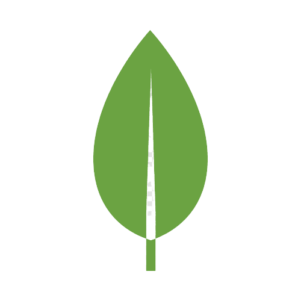

<h1 align="center">Case G2L</h1>

  

  
  
  
  
  

<h3 align="center"> In this case, a high performance REST API was created. </h3>

<h3 align="center"> Node.js  MongoDB </h3>

 Productivity and performance in a lean way, using a popular and modern language, JavaScript. 

---

## Technologies and tools

<ul>
    <li><a href="https://nodejs.org/en/">Node.js</a></li>
    <li><a href="https://www.mongodb.com/">MongoDB</a></li>
    <li><a href="https://mongoosejs.com/docs/faq.html">Mongoose</a></li>
    <li><a href="https://www.npmjs.com/get-npm">Npm</a> or <a href="https://classic.yarnpkg.com/pt-BR/docs/install/#debian-stable">Yarn</a></li>
    <li><a href="https://expressjs.com/pt-br/">Express</a></li>
    <li><a href="https://www.npmjs.com/package/nodemon">Nodemon</a></li>
</ul>

## Getting started

Clone this repository `https://github.com/annaflavia-castro/case-g2l.git`

From the project root, enter the case-g2l folder, running `cd case-g2l`

Run this command, for install the dependencies `yarn install` or `npm install`

Run this command to start the application `yarn start` or `npm start`

## Insomnia requisition collection

The collection of test requests for this project, are in the insomnia.test.json file at the root of project.

## License
This project is under the MIT license. See the [LICENSE](LICENSE.md) for details.

---

Made with ❤️ by <strong>Anna Flávia Castro

